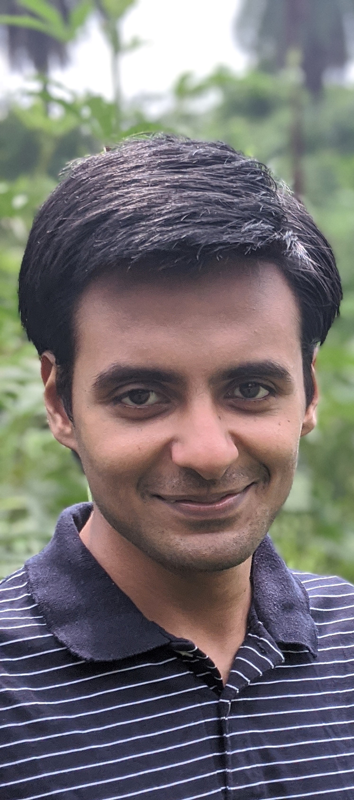

## About

<dl>
<table class="imgtable"><tr><td>
&nbsp;</td>
<td align="left">
<b>Aditya Vikram Singh</b>  
   
  
  I am a PhD student at the Department of Electrical Communication Engineering, Indian Institute of Science, where I am being advised by [Prof. Himanshu Tyagi](https://ece.iisc.ac.in/~htyagi/). Before starting my PhD in 2019, I completed my M.Tech (Research) at the Department of Electrical Engineering, Indian Institute of Science, under the supervision of [Prof. Kunal Narayan Chaudhury](https://sites.google.com/site/kunalnchaudhury/). My research interests are in the areas of statistics, information theory, and optimization. I am currently working on problems in information-constrained statistics.

   

</td></tr></table>
</dl>

